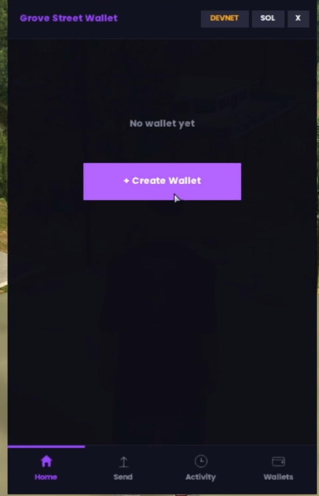
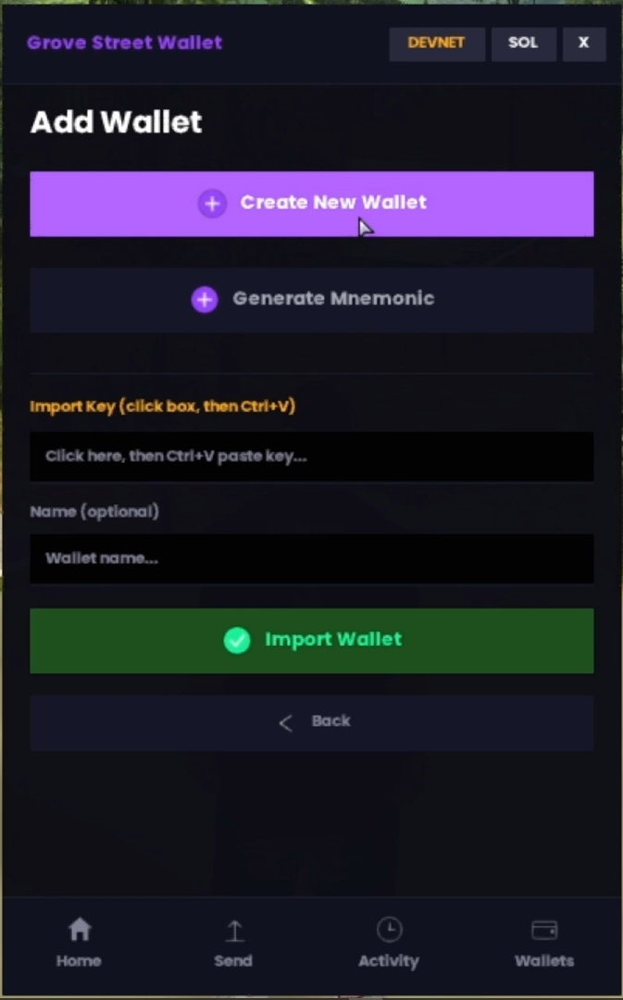
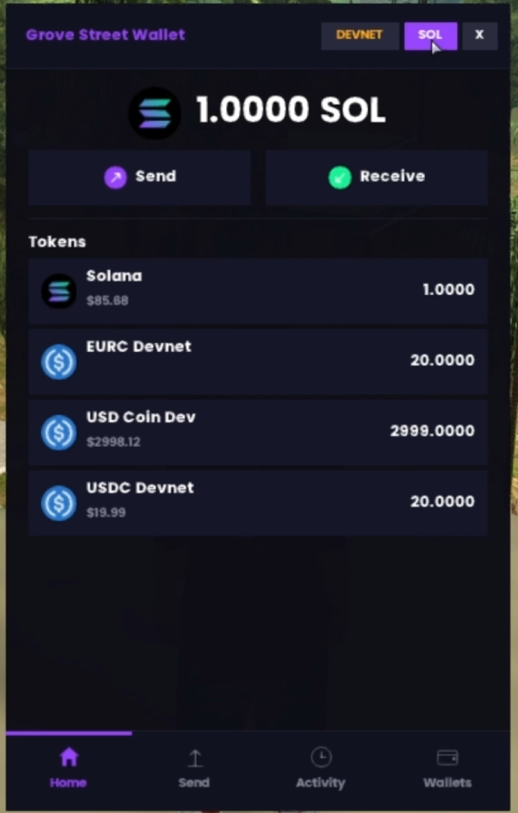
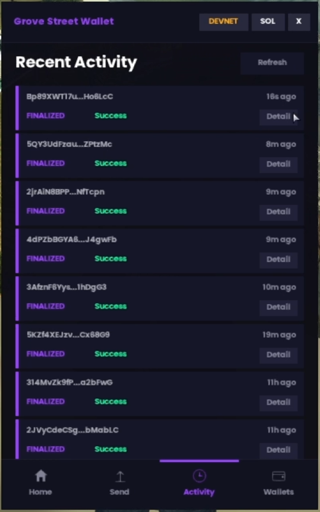
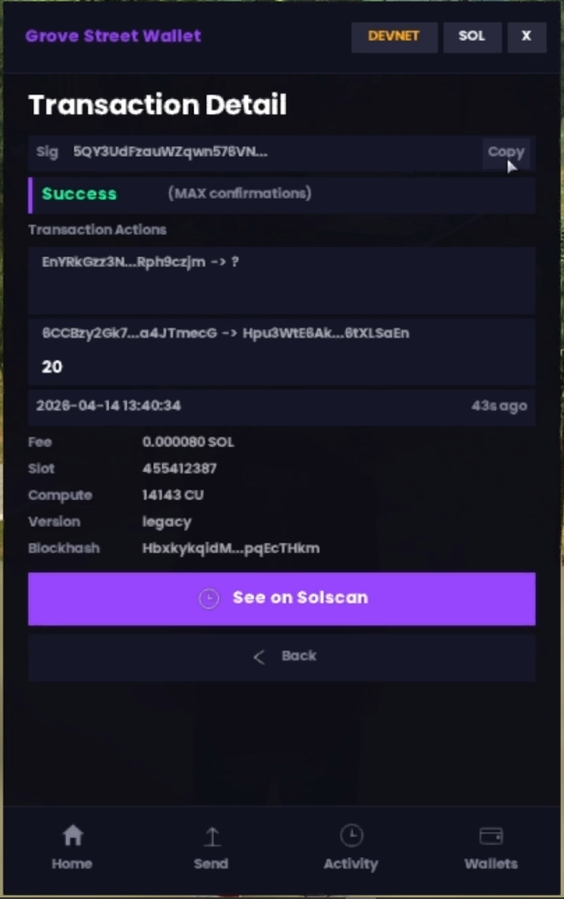

# Grove Street Wallet

> *"Ah shit, here we go again."* - CJ, 1992
>
> GTA 6 is coming this year, but before we leave San Andreas for good, we gave CJ a Solana wallet. Grove Street is home, and now it's on-chain too.

## What is Grove Street Wallet?

Grove Street Wallet brings a real Solana wallet into MTA:SA (Multi Theft Auto: San Andreas). Players can create wallets, hold SOL and SPL tokens, send crypto to each other, and track their transactions, all from inside the game, without alt-tabbing to a browser or opening a separate app.

Think of it like having Phantom wallet, but it lives inside your game screen. You open it with a keybind, and you get a full wallet UI rendered with DirectX, dark theme, token list, send/receive buttons, transaction history, the whole thing. It connects to the real Solana blockchain (Devnet for testing, Mainnet for production), so every transaction you make is an actual on-chain transaction that you can verify on Solscan.

MTA:SA is not a dead game. Right now there are **22,206 players online across 5,336 public servers**, with an active modding community that keeps growing. The ecosystem is huge, and server owners are always looking for new ways to make their servers stand out. This project gives them something completely new: a working Solana wallet that lives inside the game.

The idea came from a simple question: **what if game servers could interact with blockchain natively?** Not through a web bridge, not through an external API wrapper, but directly from the game's own scripting engine. That's exactly what this project does.

## What is the Solana SDK?

The SDK is the engine behind everything. It's a pure Lua implementation of the Solana client stack, written from the ground up, with zero external dependencies.

That means Ed25519 digital signatures, SHA-512 hashing, BIP39 mnemonic generation, Base58 encoding, transaction serialization, and JSON-RPC communication are all implemented in plain Lua. No compiled C libraries, no FFI calls, no binaries to install. Just Lua files that you drop into your MTA:SA server and it works.

Why does this matter? Because MTA:SA only runs Lua. There's no way to install npm packages or link Rust crates. If you want cryptography, you have to write it yourself. So we did, the SDK implements the full Ed25519 curve arithmetic, SLIP-0010 key derivation, PBKDF2 for mnemonic seeds, and the complete Solana transaction format. It follows the same standards as Phantom and Solflare, so wallets created here are compatible with those apps and vice versa.

The SDK exports 50+ functions that any MTA:SA resource can call. You don't need to understand cryptography to use it, just call `exports["solana-sdk"]:transferSOL(from, to, amount, callback)` and the SDK handles everything: loading the keypair, fetching the latest blockhash, building the transaction, signing it with Ed25519, serializing it to base64, and sending it to the network via JSON-RPC.

## Screenshots

<p align="center">
  
  
  
</p>
<p align="center">
  
  
</p>

## What It Does

- **Create or import wallets**, generate a new keypair, use a 12/24-word mnemonic phrase, or paste a private key from Phantom/Solflare
- **Check balances**, SOL and SPL tokens (USDC, USDT, etc.) with live USD/IDR price conversion via CoinGecko
- **Send SOL and tokens**, transfers happen on-chain with automatic ATA (Associated Token Account) creation for the recipient
- **Transaction history**, see every tx with status, fee, slot, compute units, and a direct link to Solscan
- **Devnet and Mainnet**, switch networks per wallet
- **Encrypted storage**, private keys are stored in SQLite, encrypted with AES-128-CBC using a unique key per player

## How It Works

```
Player opens wallet in-game
        |
    client.lua (DirectX UI, input handling)
        |  triggerServerEvent
        v
    server.lua (database, encryption, logic)
        |  exports["solana-sdk"]
        v
    solana-sdk (crypto, transaction builder, RPC)
        |  fetchRemote
        v
    Solana Blockchain
```

The wallet UI is rendered with DirectX draw calls on the client side. All sensitive operations (key storage, signing, RPC calls) happen on the server. The client never sees a private key.

## Project Structure

This repo has three MTA:SA resources:

| Folder | What it is | Details |
|--------|-----------|---------|
| [`solana-sdk`](solana-sdk/) | Core library, Ed25519 signing, BIP39 mnemonics, transaction builder, JSON-RPC client. 50+ exported functions, zero dependencies. | [README](solana-sdk/README.md) |
| [`solana-example`](solana-example/) | Command-line demo, 20+ chat commands (`/solsend`, `/solbalance`, `/solairdrop`, etc.) that show how to use every SDK function. Good for testing and learning. | [README](solana-example/README.md) |
| [`solana-example-wallet`](solana-example-wallet/) | The wallet app, full DirectX UI, SQLite database, AES encryption, price feeds. This is what players actually use. | [README](solana-example-wallet/README.md) |

```
┌─────────────────────┐  ┌─────────────────┐  ┌──────────────┐
│ solana-example-wallet│  │ solana-example   │  │  solana-sdk  │
│ Wallet UI            │  │ Chat Commands    │  │  Library     │
│                      │  │  20+ commands    │  │  Ed25519     │
│ DirectX UI           │  │  full demo       │  │  BIP39       │
│ SQLite + AES         │  │                  │  │  RPC client  │
│ Price feeds          │  │                  │  │  50+ exports │
└──────────┬───────────┘  └────────┬─────────┘  └──────┬───────┘
           │                       │                    │
           └───────────────────────┴────────────────────┘
                        exports["solana-sdk"]
```

## Project Components

### 1. solana-sdk (Core Library)

The foundation of everything. A pure Lua library that talks directly to the Solana blockchain, no external binaries, no dependencies.

**What it does:**
- Ed25519 cryptography from scratch, signing, key derivation, SHA-512, SHA-256, HMAC
- BIP39 mnemonic phrases (12/24 words) with Solana derivation path `m/44'/501'/0'/0'`
- Base58 encoding/decoding for Solana addresses
- Transaction builder and signing (legacy v0 format)
- Async JSON-RPC client covering 30+ Solana methods
- Instruction builders for System Program, SPL Token, ATA, Memo, and custom/Anchor programs
- Wallet management, import/export in Hex, Base58, JSON, and BIP39 formats
- Offline token registry (16 mainnet tokens, 3 devnet tokens)
- Works with Phantom, Solflare, and Solana CLI key formats

**Specs:** 10 Lua files, server-side only, 50+ exported functions, supports Mainnet/Devnet/Testnet/Localnet, async callbacks via `triggerEvent`

**Details:** [`solana-sdk/README.md`](solana-sdk/README.md)

---

### 2. solana-example (Demo Resource) `BETA`

A command-line demo that covers every SDK function through in-game chat commands. Works as both a tutorial and a test tool. Still in beta, some commands may change in future updates.

**What it does:**
- 20+ chat commands for all blockchain operations
- Wallet management, create, import from mnemonic/private key, export, remove
- On-chain queries, balance, account info, token list, transaction history
- SOL and SPL token transfers
- Advanced token ops, approve delegates, revoke, burn, close accounts
- Custom program calls and Anchor interaction with auto discriminator
- Atomic multi-instruction transactions
- Real-time balance monitoring (polls every 5 seconds)
- Devnet airdrop

**Commands:**
- `/solwallet create` / `phrase` / `import` / `list` / `export` / `remove`
- `/solbalance`, `/solaccount`, `/soltokens`, `/soltxhistory`
- `/solsend`, `/soltokensend`, `/solapprove`, `/solrevoke`, `/solburn`, `/solcloseacc`
- `/solcustom`, `/solanchor`, `/solmemo`, `/solmultitx`
- `/solairdrop` (devnet), `/solwatch` (live monitor)
- `/soltest` (Ed25519 self-test), `/solhelp`

**Specs:** 3 files (server.lua ~791 lines, client.lua ~17 lines, meta.xml), depends on solana-sdk, all blockchain ops run server-side

**Details:** [`solana-example/README.md`](solana-example/README.md)

---

### 3. solana-example-wallet, Grove Street Wallet (Wallet Application)

The actual wallet that players use. Full visual interface rendered with DirectX inside the game.

**What it does:**
- DirectX UI with dark theme, purple/green accents, looks and feels like a real mobile wallet
- 9 navigation screens, Home, Send, Receive, Tokens, Wallets, Add Wallet, Mnemonic Backup, Activity, TX Detail
- Multi-wallet management with encrypted SQLite database (AES-128-CBC per player)
- Live SOL and SPL token balance tracking
- Send SOL and SPL tokens with automatic ATA creation for recipients
- Transaction history with full details and Solscan explorer links
- Real-time price feeds (SOL/USD, SOL/IDR, USDC/USD, USDC/IDR) via CoinGecko, updates every 60s
- Currency toggle, display balances in SOL, USD, or IDR
- Devnet and Mainnet-beta support, switchable per wallet
- Full input system, keyboard typing, Ctrl+V paste, tab cycling, blinking cursor

**Specs:** Server-side (database, encryption, blockchain), client-side (DirectX rendering, input handling), 400x640px responsive panel, Poppins-Bold font (10/13/20/28pt), 14 custom icons, depends on solana-sdk

**Details:** [`solana-example-wallet/README.md`](solana-example-wallet/README.md)

---

### Side-by-side

| | solana-sdk | solana-example | solana-example-wallet |
|--|-----------|----------------|----------------------|
| **Type** | Library | Demo / tutorial | Production app |
| **For** | Developers | Developers learning | Players |
| **Interface** | API (exports) | Chat commands | DirectX UI |
| **Database** | None | None | SQLite + AES-128 |
| **Key storage** | In-memory | None | Encrypted per-player |
| **Price feeds** | No | No | CoinGecko |
| **Networks** | All | Devnet | Devnet & Mainnet |
| **Dependencies** | None | solana-sdk | solana-sdk |

## Data Flow

```
Player in Game
     │
     ▼
[UI Input / Chat Command]
     │
     ▼
Client Script (client.lua)
     │  triggerServerEvent
     ▼
Server Script (server.lua)
     │  ├── Database (read/write wallet)
     │  ├── Encryption (decrypt private key)
     │  └── exports["solana-sdk"]:function()
     │
     ▼
Solana SDK
     │  ├── Wallet: load keypair
     │  ├── Transaction: build & sign
     │  └── RPC: fetchRemote → Solana Network
     │
     ▼
Solana Blockchain (Devnet/Mainnet)
     │
     ▼
Response (via triggerEvent callback)
     │
     ▼
Server → format results
     │  triggerClientEvent
     ▼
Client → display in UI / chat
```

## Built With

| Tech | Why |
|------|-----|
| Lua | Only language available in MTA:SA |
| Ed25519 | Solana's signature algorithm, implemented from scratch in pure Lua |
| BIP39 / SLIP-0010 | Industry-standard mnemonic phrases, same derivation path as Phantom (`m/44'/501'/0'/0'`) |
| Base58 | Solana address encoding |
| JSON-RPC | Talking to Solana validator nodes |
| SQLite | Wallet storage on the server |
| AES-128-CBC | Encrypting private keys at rest, unique key per player |
| DirectX | Drawing the wallet UI inside the game |
| CoinGecko API | Live SOL/USDC prices |

## Getting Started

1. MTA:SA server (minimum `1.5.4-9.11342`)
2. Drop `solana-sdk`, `solana-example`, and `solana-example-wallet` into your resources folder
3. Start `solana-sdk` first, then the others
4. For the wallet UI: start `solana-example-wallet` and open it with the keybind in-game
5. For the command-line demo: start `solana-example` and type `/solhelp`

## Security

- Private keys never leave the server. The client only sends user input and receives display data.
- Keys are encrypted with AES-128-CBC before hitting the database. Each player gets a unique encryption key derived from their serial + account ID + salt.
- The random number generator in the SDK uses `math.random()` and `getTickCount()`, fine for devnet testing, but for real funds, import a key from Phantom or Solflare instead.
- Signing takes ~0.3-0.5 seconds per transaction (expected for pure Lua crypto on a game server).

## Coming Soon

- **Smart contract interaction**, call any on-chain program directly from the wallet UI, not just transfers
- **DApp browser**, connect to Solana dApps (DEX swaps, NFT marketplaces, staking) without leaving MTA:SA
- **Anchor program support**, auto-generate UI forms from Anchor IDLs, so players can interact with any Anchor program by just pasting the program ID
- **On-chain game items**, mint, trade, and equip NFT-based items tied to in-game assets
- **Multi-sig transactions**, require multiple players to approve a transaction before it goes on-chain

## Author

**0xverse** or **yongsxyz**

